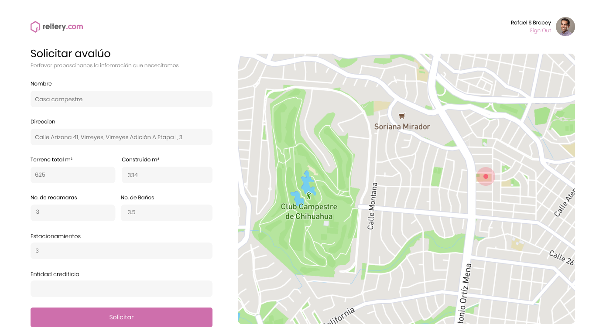

**Reltery.com** es una aplicación web diseñada para predecir el valor tu inmueble, implementando el análisis de datos y el uso de redes neuronales entrenadas con información tomada de tu misma localidad.


Nuestro **modelo basado en redes neuronales** toma aspectos físicos y económicos de tu inmueble. Esta información será procesada por cada neurona de nuestra red para predecir en conjunto el valor que tu inmueble puede tener en el mercado, de forma rápida y confiable.



Todo ello no seria posible sin la aplicación del filosofía de **software como servicio**, con un servidor dedicado a la implementación del modelo de inteligencia artificial, que provee servicio a diversas aplicaciones adaptadas a los dispositivos presentes en el mercado, brindando así una mejor experiencia de al usuario y permitiendo a los desarrolladores implementar mejoras o adecuaciones al modelo.


## Despliegue del proyecto 🚀
A continuación se provee información para poder correr de forma local **Reltery.com**.

## Backend

### Requerimientos 📋

```
Python3
pip
virtualenv
```

### Instalación 🔧

```
git clone [project_url]
```

En el directorio raíz del proyecto

```
virtualenv venv (as administrator or sudo)
cd venv\
source bin\activate (linux)
Scripts\activate (windows)
```
Activar el entorno virtual

```
pip3 install -r requirements.txt
python3 manage.py makemigrations
python3 manage.py migrate
python3 manage.py createsuperuser
python3 manage.py runserver
Access localhost:8000
```